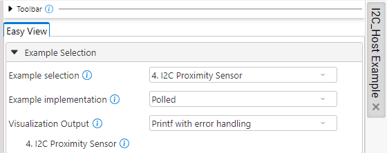
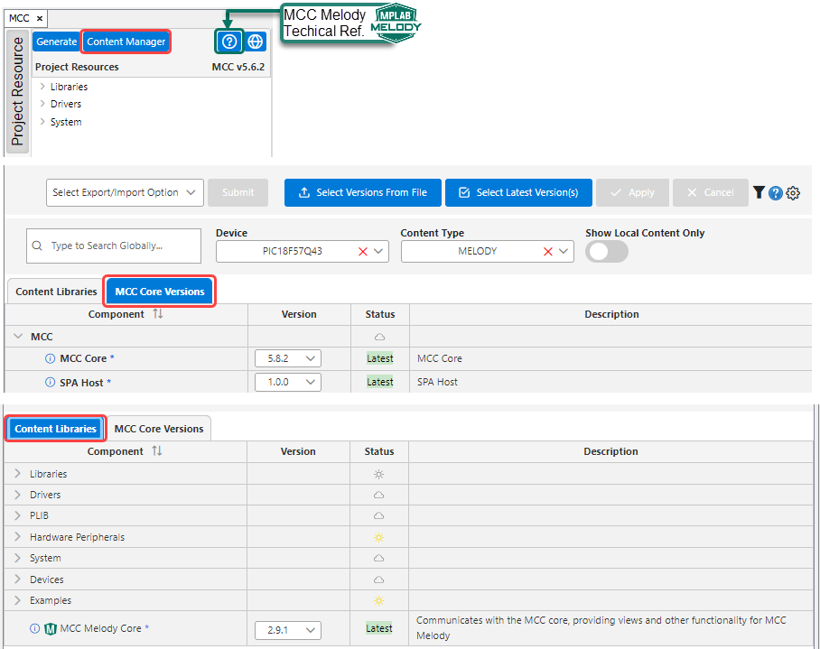

<!-- MPAE-19443 Please do not change this logo with link -->

<a target="_blank" href="https://www.microchip.com/" id="top-of-page">
   <picture>
      <source media="(prefers-color-scheme: light)" srcset="images/mchp_logo_light.png" width="350">
      <source media="(prefers-color-scheme: dark)" srcset="images/mchp_logo_dark.png" width="350">
      
   </picture>
</a>

# AVR128DB48 I2C_Host Example Component for CNano Explorer: I2C Proximity Sensor (Polled, Printf-errors)

The [I2C Proximity Sensor example](https://onlinedocs.microchip.com/v2/keyword-lookup?keyword=I2C.HOST.EX.RUNNING.I2C.HOST.PROXIMITY.SENSOR&version=latest&redirect=true "I2 Proximity Sensor example"
), of the [MCC Melody I2C Example Component (for the Curiosity Nano Explorer)](https://onlinedocs.microchip.com/v2/keyword-lookup?keyword=I2C.HOST.EXAMPLE.COMPONENT&version=latest&redirect=true "MCC Melody I2C Example Component for the Curiosity Nano Explorer"
), is used here in the Polled implementation Printf with the Error Checking visualization. 

This example demonstrates how to read the value of the VCNL4200 proximity sensor on the Curiosity Nano Explorer. Every 250 ms, an LED and a Debug I/O pin are toggled and a printf message is sent to the  [MPLAB® Data Visualizer](https://www.microchip.com/en-us/tools-resources/debug/mplab-data-visualizer "MPLAB® Data Visualizer").  

## Operation

The below image of the MPLAB Data Visualizer shows the application running, where the proximity value is displayed on the Data Visualizer terminal every 250 ms and a Debug I/O is toggled.

To run the example, follow the steps in the Data Visualizer Setup section of the I2C_Host Example Component: 

- [Data Visualizer Debug GPIO Setup](https://onlinedocs.microchip.com/v2/keyword-lookup?keyword=I2C.HOST.EX.DV.DEBUG.IO&version=latest&redirect=true)
- [Data Visualizer Setup for Terminal](https://onlinedocs.microchip.com/v2/keyword-lookup?keyword=I2C.HOST.EX.DV.TERMINAL&version=latest&redirect=true) 

## Setup
The following is a block diagram view of the application, as seen in the MPLAB Code Configurator (MCC) Melody [MCC Melody Builder](https://onlinedocs.microchip.com/v2/keyword-lookup?keyword=MCC.MELODY.BUILDER&version=latest&redirect=true "MCC Melody Builder"). On the right hand side, the completed TODO list of the I2C Host Example Component represents the MCC Melody configuration of the application.

## MCC Melody Example Components
Example Components integrate learning material directly into the MCC. This allows the users to conveniently place the configuration instructions side-by-side to the components they are configuring. For more information, refer to the [MCC Melody Example Components](https://onlinedocs.microchip.com/v2/keyword-lookup?keyword=MCC.MELODY.EXAMPLES&version=latest&redirect=true) introduction. 

## Related Documentation

- [MCC Melody I2C Example Component (for the Curiosity Nano Explorer)](https://onlinedocs.microchip.com/v2/keyword-lookup?keyword=I2C.HOST.EXAMPLE.COMPONENT&version=latest&redirect=true "MCC Melody I2C Example Component for the Curiosity Nano Explorer")
- [MCC Melody Design Patterns for Control Flow](https://onlinedocs.microchip.com/g/GUID-7CE1AEE9-2487-4E7B-B26B-93A577BA154E "MCC Melody Design Patterns for Control Flow")

- [Curiosity Nano Explorer User Guide](https://ww1.microchip.com/downloads/aemDocuments/documents/MCU08/ProductDocuments/UserGuides/CNANO-Explorer-UserGuide-DS50003716.pdf "Curiosity Nano Explorer Users Guide")

- [AVR128DB48 Data Sheet](https://ww1.microchip.com/downloads/en/DeviceDoc/AVR128DB28-32-48-64-DataSheet-DS40002247A.pdf "AVR128DB48 Data Sheet")

## Software Used
- [MPLAB® X IDE](https://www.microchip.com/en-us/development-tools-tools-and-software/mplab-x-ide) v6.25 or newer 
- [MPLAB® XC8](https://www.microchip.com/en-us/tools-resources/develop/mplab-xc-compilers/xc8) v3.00 or newer

- [MPLAB® Code Configurator](https://www.microchip.com/en-us/tools-resources/configure/mplab-code-configurator) (MCC) Plug-in Version v5.6.2 or newer (*Tools>Plugins>Installed*, search: "MCC")
- [MPLAB® Data Visualizer](https://www.microchip.com/en-us/tools-resources/debug/mplab-data-visualizer) Plug-in Version v1.4.1926 or newer (*Tools>Plugins>Installed*, search: "Data Visualizer")
- MCC Melody I2C_Host Example Component for the Curiosity Nano Explorer v1.0.0 or newer
- MCC Core v5.8.2 or newer 
- Single Page Application (SPA) Host v1.0.0 or newer
- MCC Melody Core v2.9.1 or newer

Open the MCC Content Manager  to verify the MCC Core and MCC Melody Core versions. 

 

## Hardware Used
- AVR128DB48 Curiosity Nano [(EV35L43A)](https://www.microchip.com/en-us/development-tool/EV35L43A)
- Curiosity Nano Explorer [(EV58G97A)](https://www.microchip.com/en-us/development-tool/EV58G97A)

